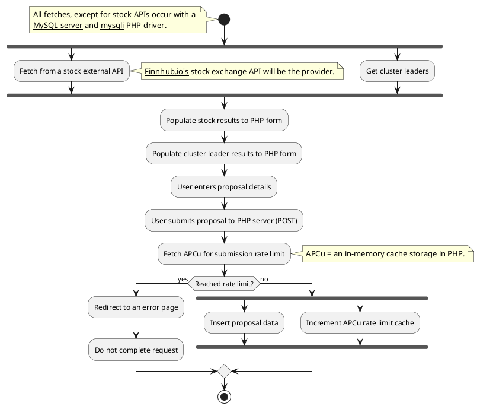

# 🌲 PlantUML Diagram

## Image:

[](https://editor.plantuml.com/uml/TLFBKjmm4BphA-QMtIf2xciWR2L5GbLICP1yW5OUhrNeOJGIOV-U6GastaDyagMUxfuUwPgoJhbufrHTgH0pWiCnAu2jSp1YDXFI6U2BmJd361DGZkOHjlqjGJIc9FXhymGQkEIYNFqyFDpz0CBqZEdYKxa27GRPzmTwShRkzDzx699bmBb2FXLHnSoFp02mkH5D65FqJDh4y2LZ2jg9QbTHrMYo-odNN_bOvCQ6C9NTkOqVg4gzbvj9XprAERlbldO8UKAOKtosW_WGWXCleFVQXkRe6sOmhX2Ru70q5r1NdLVJcpxEnMdsqzGIKd6P8CVQAMDyjm2T4lq7_OS3P3-C8p4vH-Bc1ypQEde_fhBpDY_EtoXQzh3gVptyNZEuvRdjlvGsFYaZiZ504Z_ECakdr4cYdAKKr0mlUOHWmqUFFgO36CqtGbfDcXErGJGNSrHsXDKz2cXO27nUI-01LWUaTKlr7WURq6JnpGgO4hkRcRHDUFCr2YEOw6U7uWsV2X9RHKS8gn0Rp_7YrABRmEtdHMOww-w8Mmpr3MqIUiwvnVFFRkkoErwBAi8BE_93YREwvhKycrS0)

## Code:

# Event-loop Diagram

The following is a simple explanation on how ReactPHP handles I/O tasks, such as APIs or db queries, that will block code execution (asynchronous task)

