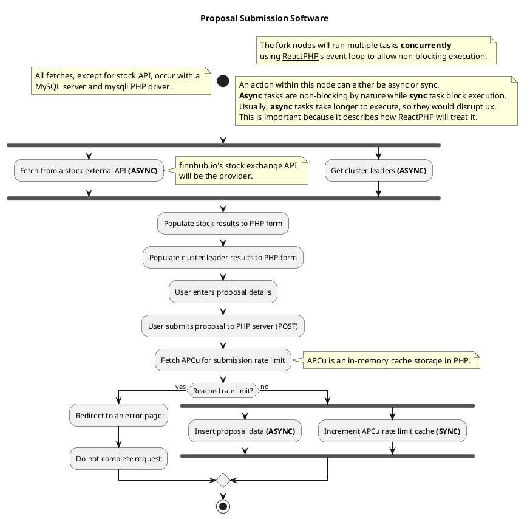

# 🫡 UML Diagram
In Software Engineering, UML or Unified Modelling Language is a standardized graphical language that allows developers to visualize the structure and behaviour of software systems, making it easier for a developers to implement their software systems in code. There are multiple different types of visualizations for a developer to choose.

The proposal submission workflow is documented using a UML Activity Graph

## Image:

[](https://editor.plantuml.com/uml/TLHDJnin4BtlhvWRYKJX3ZGbecgBr8-KmA57htUIjUAr5tyGzj_tZJU1a1OfYX9xvirxRsPy7PCAANUsgf99bcaHVE-ZihJCTMTYDDxHqg_ILWMkgX9TEP-OBAzIHJItbbQSTClnbFXPSvzevGF5vFM6velRK_9Qvq1RarfIX9IhFFinB7z_fyZXYSFLUPwHSesSTqDyjAQSBBujg0a60MSLurQALcFfODQjrBvlMMfjSDTmH0Lm2TbHbsqoFSGa5JUHhkgPzWuS0hjaXwlpUeRa78rRIyqxLZgXcbGzYSHFY2BhVK_9axBMRu7lFjGMWYI5drdd15_UvGLN705Kl1FPnX6-Og59MZbY77AWcgM-YeFJHJ9im__ztxE21FBpyQIUxVIW4syPrGCvbJAEjws1REIyIQ4IUK2S2lH3p90td4gyEggHr0OjzcuDch1XJELJYXvIUA2jpxQXniIGqV3yl8Ey5vdowNeVaeAHDMkL8vD9X1xfO6fqgeMdUzl7jgN0AY7eq5DfRK6z-283HglWEqpGE5dyd3Wup2b6J0HCvii_Fs-c8k6o91rrf7YPPolZN9lhC-DFOl5yZwPR1R45xIM-C4EJe9Zwu9zC8yCeDoyao_YfjJ9kPFgL4scR8yXXGnGIuZ_i9BbegouMlizMWUX88t34w4PnN9n1K7Tv4FGM-9te1smL-2MftE-NkU6aZ8txwoYxdGxkTn3ZGj9ayMjvFqNmwFjySPF7dNvz4eBmiGOebqV33vCbePZx4NjDndtekFDXmEZZcH2fGS5gR0Lg7ZRSh6WYOz5oSr3WqrGQu6WoS9oEBjznOmBhL3OKwnG2sFK07Lj_yTaB8cdVuHKGRloOEO8gMupYnFaHvsN0IjAjW_nqu9bAwh-JTTJpNR8EtCdBKTnwPRyJBJX7C2zZW1zcXQVLzzKrVkCn_Wi0)

## Code:

# 🔁 Event-loop Diagram

The following is a simple explanation on how ReactPHP handles I/O tasks, such as APIs or db queries, that will block code execution (asynchronous task)

Resource: https://blog.gougousis.net/the-inner-workings-of-an-event-loop-the-reactphp-case/
