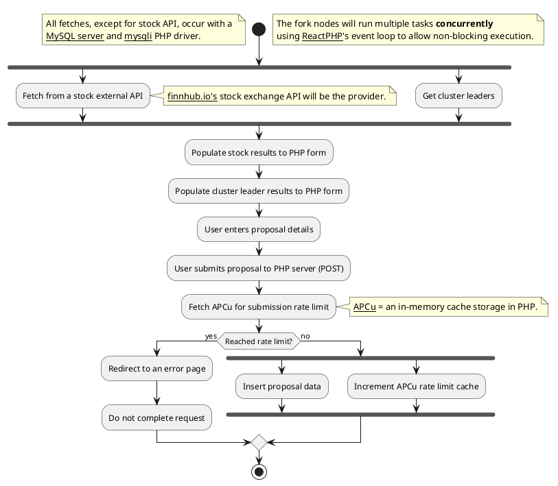

# 🌲 PlantUML Diagram

## Image:

[](https://editor.plantuml.com/uml/TPJ9Zjim38RlVWhUaW2ptECqdQ15sm6wfBCyW2pJiH1PyaXK9dxxadAISGxrIR2uVFpvsm-HLA3KsQB8fy9vGh3OK06miHOQ9DrYl04yQkm96XyWajTxs6mVRy1hdGAy6sf10QUiqlhNyFpt9qGC1moh-xG6vMfvtmtnpPhyPljZ2tKm771N8DzAqwAOmMzfhYgV2AX5wRM7UM-LnXfCrs5j5A4Te4A-GZ2q67c3sRK2_79EShx6o5WyG4WEkcJ9z1Q1LDn7M5LhxHs31tHaXzLzjURa58tR2UWJAasCAAYp27ZWAB3Uzq0UbBN-dUkxsygo2fA2HzI9Z7VJOGI3Ym8iluc2q0JViKIZT7Wa34vPqR3CKLTZZ0-JDCQvDbLtnizY5kwShblbTYZfuv0LPi7wu0-c5bMbm0KcIw9sohYHw3iIQ9iYG_2g5IV4CgDdw6AvzNsohFIfNS38-aMPNXR7GLqv2Rgkz9_eL_O30t5S5ChUHvw-HbB6nlDrJ5LdQ79_AZ5Q2URRFyyl2muU1TrilwJHZP8M8-iFGNYiuIfbSUqC5bCIieYVs95Wt6s7dGy3QCK6br63OacDavxJJPe6vcA9batuqU3pGXHtC1ymBaPPdzYV0JLbcpZ049YkvwBZYfTVlLG4xJkseh3XMyB8g6WZmjpviSx5EJdfqV7uDD5CaIelSPEjdg9rm4xyckNvm1sdB2--o4tuO1h-xdrVFF1P_WB_0000)

## Code:

# Event-loop Diagram

The following is a simple explanation on how ReactPHP handles I/O tasks, such as APIs or db queries, that will block code execution (asynchronous task)

