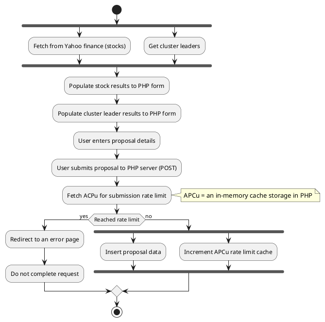

# 🌲 PlantUML Diagram

## Image:

## Code:

```plantuml
@startuml
start
fork
    :Fetch from Yahoo finance (stocks);
fork again
    :Get cluster leaders;
end fork
:Populate stock results to PHP form;
:Populate cluster leader results to PHP form;
:User enters proposal details;
:User submits proposal to PHP server (POST);
:Fetch ACPu for submission rate limit;

note right
  APCu = an in-memory cache storage in PHP
end note

if (Reached rate limit) then (yes)
    :Redirect to an error page;
    :Do not complete request;
else (no)
    fork
        :Insert proposal data;
    fork again
        :Increment APCu rate limit cache;
    end fork
endif
stop
@enduml

```
