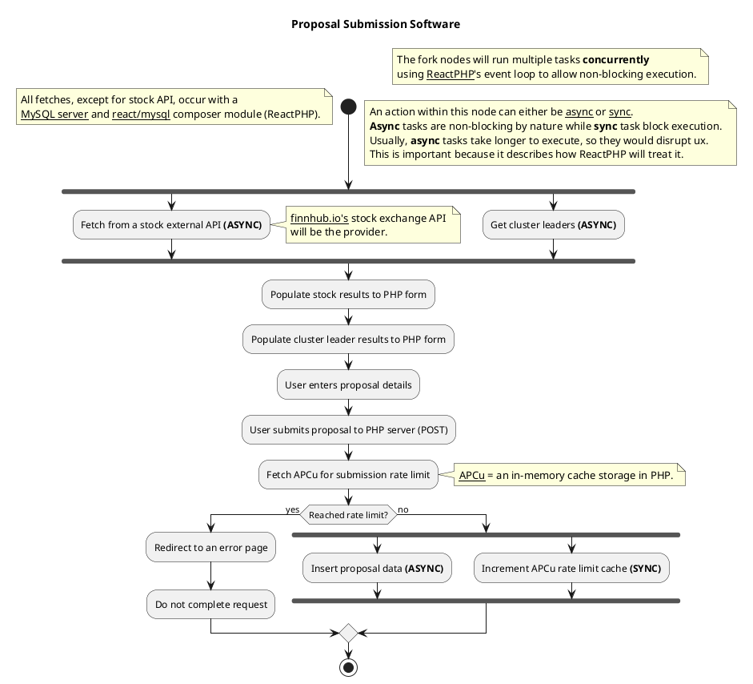

# 🫡 UML Diagram
In Software Engineering, UML or Unified Modelling Language is a standardized graphical language that allows developers to visualize the structure and behaviour of software systems, making it easier for a developers to implement their software systems in code. There are multiple different types of visualizations for a developer to choose.

The proposal submission workflow is documented using a UML Activity Graph

## Image:

[](https://editor.plantuml.com/uml/TLHDJzj04BtxLyoDH4hX3cbAHDKMgHyfWKEFw_K4hrZlclqW-D_tpJg1a1OfYkprp9itRzxiPKmgfDpPgaecMQPLyBsFoj8wrvs9qNX7Qxz9MnMugafqvNnYihn95T7IMjfmqYt76V6pvZxHnWUAoUi7MgwkP-Irpe6s9hMa22dplFWnh7z_fyZXYSFyB2z8kKRE0okTpheXFjfoh7q7DXoeyqq6kycD1Ao-hQQd5ID5c5GZds3kMo5qsx8GUC2tXYFAWc38Zhfia-c1aLHyY3Il5zex40liaXtcP_K2oJaQToz4zdM4nKaaVa8KMUzxIfwKjNuBVFUXjkXIKlYPTKuGwrrUaCeHG4LGqS8umbyiD4ahHun3T5gpr5TnSBf802tnldyzBKWWlnnFwiMk7updBQDw8ATInl6sDMWREMzIg4GU4AS2VHSpsXjc4g-EQYJrWBbxTm-Qa65CvHb5ZrPueAtFjg76n93XWloyWxoLDkM7MOQa86JDMkN8P19XHZgO6fDgeUbUzd5i2NP823hKL4PRKC-_YEje4tm7Mursu-V4mS6yy9qqC5ck__oycaeB5oNfQ295oxpO6EVQN9yQVnABvdiqtIeqMz1UuWip30aTKn_yasauZ5Dv8Ldif-wLSIFJhvn8snn13ckZa13_OIV9fRVgVENxR1M8ZZG2HrWtYkAY38AwYuEWjy3lHD_93i72KhdVRtZ3IHaRzv-ZB7mw-Bw36BUK9gjVwzifWaVTbwkhF2xwwpqHX8yrGBauCZz4beGYxaSiEndteUFEXm7MnzqXhGO5gR4Lg7auSBCPjxxbvg30fwaCmD5au3WTLRxXnWJMgMmerYa4iEi1Eex-_BCNn7AbM1Pk_9WvWYfRM77Y_8ZpOh2ITEtGVZhGJ2NrNsSTpNoNh0DtSdCKjLxPxveMd2EO5nlWmMnmt_g-kiGpRkY_)

## Code:

# 🔁 Event-loop Diagram

The following is a simple explanation on how ReactPHP handles I/O tasks, such as APIs or db queries, that will block code execution (asynchronous task)

Resource: https://blog.gougousis.net/the-inner-workings-of-an-event-loop-the-reactphp-case/
