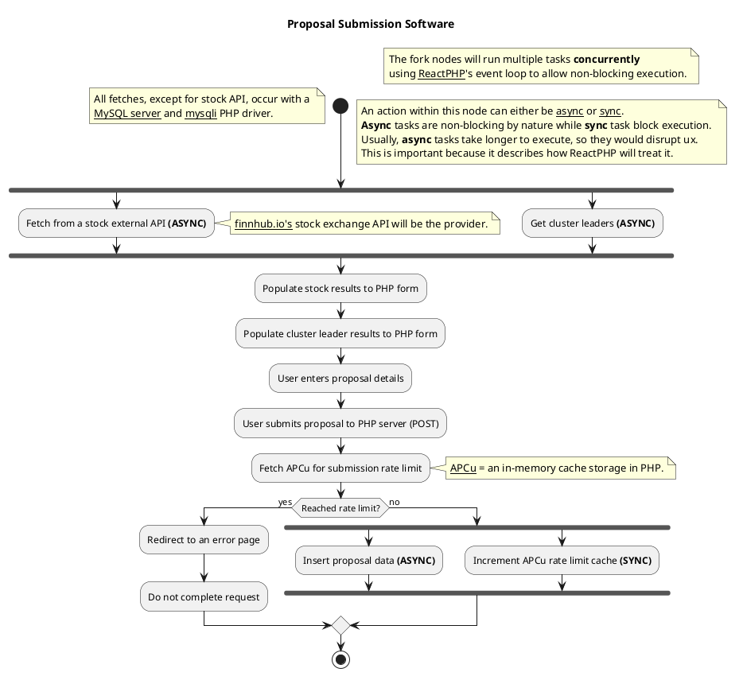

# 🫡 UML Diagram
In Software Engineering, UML or Unified Modelling Language is a standardized graphical language that allows developers to visualize the structure and behaviour of software systems, making it easier for a developers to implement their software systems in code. There are multiple different types of visualizations for a developer to choose.

The proposal submission workflow is documented using a UML Activity Graph

## Image:

[](https://editor.plantuml.com/uml/TLHDJzj04BtxLyoDHA9m1veIKRL5waTAuD3ZUZs9LrdlclqW-D_tpJg1a1OfYkprp9lttipiTKmgfDpPgaecMQP5yBsFoj8orvs9qNX7IxzAMnMugafqvNnYihnA5T7SMbfnqYt7K-9dpNsYbGyKazSRcYzkJybhdGDjJMf94LAkykp7iFpzdIA79mvNvtb6oZLotWtnqPfoilYse2OO19nLZAzIj1fB1xDkfVPzor9hWsyDHrG0bv0TTTacqqDCKd4JwQgUQU_08R1BThWwhsT8pj6ujTIyOwKJgadLaqZyX2YotlUKF2bh_HRuxaDj8KXI-9brJl3bNLvmnH50nJkHRHpXBnQQf9KZnY47gbdggpWuNIJ3DhplNyyA4iZFnvDwjjE3JhnbL0_aLCeuthO6if7p9eLAv05nAj0FCKFUS2hnwgX6KXkqsBirQCA6CPLFANf8uO6sFjk66XD3HiFpymxoNcJAh-jzI0f6rgnLZamc4NgaWwdHgHQUxcqVsvO2guIWGq-bjGNrueiC6As2xp11usJnS-BWCASOCH4mcI___BoPYeJBadJKaU9bdgsCSsskpum_YSNpFPfk5SGMj488lO5GweD_CetCe02yS2jJfzRAk97WLqwaROxWXCLGI8Z_a9Ba8gcwMFW-MmL-O_N04HCRnMWn147TvK7GM-1teX-mJE2Nf7A_t-66ap8sxZz7MUbqy7q7CUuXJHQ_blTJ18zspnStULpbrviW21zhW79vDFFmLXAAfn-npcJSXuux7mPCF6u7aHeK7COoeEPXdysA9Z8DBJS71JvDfG6E9WF7wUZo7JSci4vbCR558O1T3z2nunUVlI2IzXsMNxZnO-O8gcmnWHFdHvoNkIf9jmxoqu5dAgd_3jHHptV9Ed0d5qPnwvNzJhJW7C6yZ04Up0etgk-hQppZ3luB)

## Code:

# 🔁 Event-loop Diagram

The following is a simple explanation on how ReactPHP handles I/O tasks, such as APIs or db queries, that will block code execution (asynchronous task)

