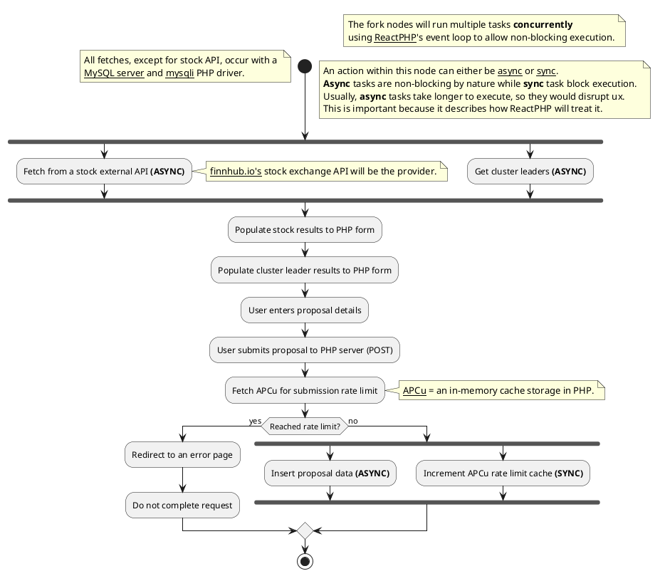

# 🌲 PlantUML Diagram

## Image:

[](https://editor.plantuml.com/uml/TLJBRjim4BpxA_OM6t2IU-AwCLAq3T27cyUXHufQMuGfKk4Zjlw-ivITEcu368P4xSxEpExo9YOLKcxjQ5IUHiud9ikhD29QM4ihJhhXE2NUQUuIhNoWcBpUq69vDoMlTGwqDQaXHKYPvVdt_k7NDueSNZZCBlESbAlblEtZipNbPFbrINKm2BWOCRvAqT5GEfXr8xKV6vPQ6tohEQ82k8JigCqscSuo9HKtaMRLN7i73e5TiltiifeZEKVZrbBpdfLEg2PLpoBn2wB8UjzHygIizLlWk_FAGf2ay8vrJiQxTtd15KS0HKoHRHpXBnQQf9KZnY47gbZggzWxNIJ3DhmVNYyA4iWlXfDgljUZ0hzbLFNaLCeutZO6if7p9eLAv15nAj1FCKDUFvLuTL8ZgGrQxDqQD673aCfJYXvIkAUjpxQcsiIGqV2ysqC-YapvjPqFIS78YhNAaSaaGezqC1KwrS3JW-r3sr9WbH1qxAcqjg1UVPO1erNmBIPec2pU9GvEMHan4J1UFFp-SJiH2TSbwQGZnSiyNnddcbnT67yMY-S7DDqeY2reXH1w0w7K1VzYQfb10NZbLgPEhPLn0y4ld4ZR7C49Yw6G4FyX9Sb5qkXgwRji5VWDrGD7J6mKeyKG1BNNHq5lWT-9Vi8oWL-IoY3T-GXlQaxAs7Zu77FLcdJqVGynx26DbpyV7YS87knUB6_piCgI5gDCSn0-rW3b-cJcuQqa54y_O9t9kFEMMnzwJ3nk1v4Q51p6Cg3cSP_DYiOo3GtNHmK-JgG1ZiOznydWyZtN9h1EPJ6nHI60NGVGeUDNdxmWalOjbb-uyNFc2AfiCO5ZvmUSrxagINSEyjEHPogf_mxKIS_toJfmAnT6SUil-xremJc1UHq3F9WLRbJVZMxmZFlr3m00)

## Code:

# Event-loop Diagram

The following is a simple explanation on how ReactPHP handles I/O tasks, such as APIs or db queries, that will block code execution (asynchronous task)

