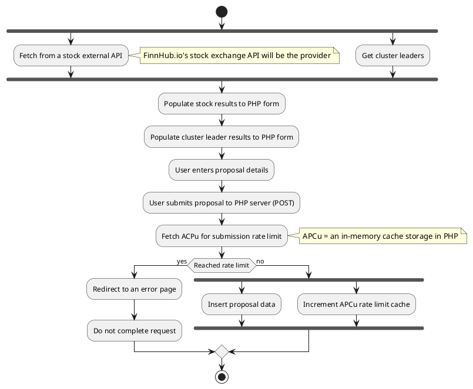

# 🌲 PlantUML Diagram

## Image:

[](https://editor.plantuml.com/uml/TL91KiCm3Bpx5RgH7k01pJ3JJXbeJsGAFC1rbCPJnmwMNUZlaUqIqWC-oQFLQhNIYeBq8Gv6v41qpfy4y5i-Or0zTDuD8862KoV0xu3UIWFhPbTdb7K1mUjZ7_8tlMTjxJOU7hIxewbEzT8UCTN1bpO63WYXHnYzE-iMVIv6ssQ-h07aKMfRbBnW06KYSNCmA1bFjKZeB7RPk34QoJfACuyKJI083ffjap13FGFT4ls3_Y1EeMKS9OsZ8nwwnI2reTyqnSEWmon_fU3ScTDLy_hslc1myN6zQM9YBsL4sbdmIO_Hp58BSUFakjb4U0HfGTlx0GVdBw2awlECNhAJsgPcOl9Cw0wgFIPCEoDU99ijL1UaHJ5pZwtsg4AIo_peFOiQcR8iTFda4Y4eDum6aoJyZ4Yi40qXLDOLdkbESj7EyjHXPfKCifvmirrUqShZmFQMEV_KbXdhwHfo4mvqnzVfHh7YE9tg3m00)

## Code:

